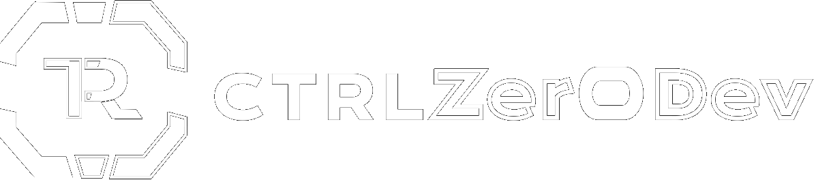

### Open-source software, systems research, and developer tools built by a small independent team.

[Website](https://ctrlzero.dev/) · [Repositories](https://github.com/orgs/CTRLZer0/repositories) · [Documentation](https://github.com/CTRLZer0/controldocs)

---

## About us

**CtrlZer0Dev** is a small independent team formed by **Seregon**, focused on software engineering and systems development, and **France**, focused on design and product experience.

We are university students who spend much of our time outside classes designing, building, testing, and maintaining software we genuinely want to exist. Our work ranges from low-level systems and compatibility layers to developer tooling, protocols, research, and polished user-facing applications.

We care about software that is **open, technically ambitious, understandable, and thoughtfully designed**.

## What we work on

Our projects commonly explore areas such as:

- **Systems software & runtimes** — compatibility layers, runtime infrastructure, platform integration, and low-level tooling.
- **Developer tools** — utilities and frameworks intended to make difficult technical workflows easier to understand and use.
- **Research & experimentation** — prototypes, technical papers, and experiments around software architecture and emerging platforms.
- **Networking & protocols** — efficient communication layers and cross-platform infrastructure.
- **Product & interface design** — keeping powerful software approachable through clean, coherent interfaces.

## Selected public projects

### [libobjc2](https://github.com/CTRLZer0/libobjc2)
Work around the modern Objective-C runtime and its surrounding compatibility ecosystem.

### [Mosaic-Packages](https://github.com/CTRLZer0/Mosaic-Packages)
Public signed iOS/arm64 runtime packages and catalogs used by the Mosaic ecosystem.

### [controldocs](https://github.com/CTRLZer0/controldocs)
Technical papers, documentation, and research material published by CtrlZer0Dev.

### Mosaic
A native-first compatibility runtime focused on running macOS applications on iOS and iPadOS without relying on streaming. Mosaic explores low-level runtime compatibility, platform abstraction, application packaging, and developer tooling across the Apple ecosystem.

## How we build

We try to keep a few principles consistent across everything we work on:

**Open by default.** When a project can be developed in public, we prefer transparent code, documentation, and reproducible work.

**Engineering before hype.** We would rather solve a difficult problem properly than hide it behind a superficial abstraction.

**Design is part of the product.** Good software should not only work well; it should also be understandable and pleasant to use.

**Iterate continuously.** We test, refactor, document, and improve our projects as they evolve instead of treating releases as the end of development.

## The team

| | Focus |
| --- | --- |
| **Seregon** | Software engineering, systems programming, runtimes, tooling, research |
| **France** | Product design, visual design, UX, project identity |

## Join the team

CtrlZer0Dev is a small team, but it does not have to stay that way. If you are interested in systems programming, runtimes, developer tooling, research, networking, UI/UX, documentation, testing, or design, contributing to our projects is the best way to get involved.

We welcome thoughtful pull requests, bug reports, technical discussions, testing, documentation improvements, and new ideas. Consistent contributors who share our approach to open development and care about the quality of the work may also have the opportunity to become a more permanent part of the team.

You do not need to know everything before contributing. Pick a project that interests you, explore the codebase, join an existing discussion, or open an issue with an idea you would like to work on.

## Follow our work

You can explore our public repositories here on GitHub or visit **[ctrlzero.dev](https://ctrlzero.dev/)** for more information about the team and our projects.

If something we build is useful to you, contributions, testing, bug reports, technical discussion, and sharing the project are always appreciated.

---

**Built by a small team, for people who enjoy ambitious software.**

